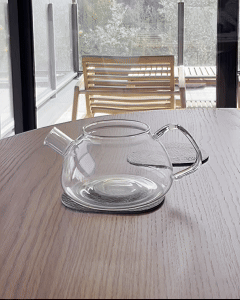

This repo contains a [Vision Transformer](https://arxiv.org/abs/2010.11929) video model based on the [VideoMAE V2 paper](https://arxiv.org/abs/2303.16727) and [code](https://github.com/OpenGVLab/VideoMAEv2),
as well as examples for compiling the model using TensorRT and running inference using the built engine.

It is part of a [blog post](https://ohadravid.github.io/posts/2025-01-debugging-vit-and-tensorrt) describing an issue with compiling this model using TensorRT - to get a working engine you'll need to find the `Uncomment and change this to use the desired attention module` line and use one of the working Attention layers.

# Download the weights

Download the distilled checkpoint by running:

```bash
wget https://huggingface.co/OpenGVLab/VideoMAE2/resolve/main/distill/vit_s_k710_dl_from_giant.pth
```

# How to use

After downloading the weight, you can run inference.

For the included video:



Running:
```bash
uv run python main.py infer
```

Should print something like:
```bash
making tea: 0.81
setting table: 0.01
opening door: 0.01
```

# Commands

Note: be sure to use an Attention layer that works with TensorRT.

```bash
# Use faster settings for torch inference (half precision, torch.compile, ..)
uv run python main.py infer --fast

# Export the model to an ONNX file
uv run python main.py export_onnx

# and run inference using ONNX runtime
uv run python main.py infer_onnx

# Build a TensorRT engine from the ONNX
uv run python build_trt.py

# and run inference using the built engine
uv run python main.py infer_trt
```

# Testing with different version of TensorRT

Checking with different TensorRT versions can be done using `docker` and [NVIDIA's `pytorch` images](https://catalog.ngc.nvidia.com/orgs/nvidia/containers/pytorch):

```bash
$ docker run --gpus all --rm -it -v $(pwd):/code -w /code nvcr.io/nvidia/pytorch:24.12-py3 bash
$ root@cd60802e9604:/code# pip install "onnxruntime>=1.17.1" "pyav<14.0.0" "timm>=1.0.12"
$ root@cd60802e9604:/code# python ./main.py export_onnx && python ./build_trt.py  && python ./main.py infer_trt
```